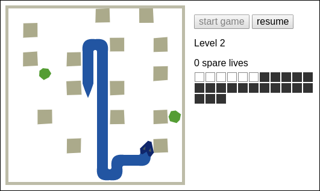

# Snake game

## A web implementation of the classic snake concept

You control a snake with a cluster of four keys. You can use the WASD,
IJKL, or arrow-key cluster.

- W , I , &uarr;: north
- A , J , &larr;: west
- S , K , &darr;: south
- D , L , &rarr;: east

Eat the green gems to grow. Avoid the brown blocks and walls.

As an alternative to the `start game` and `pause`/`resume` buttons,
you can use keyboard shortcuts:
- W I &uarr;: start game
- space bar or Shift key: pause/resume

